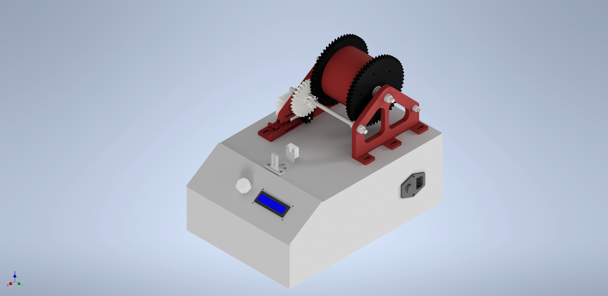
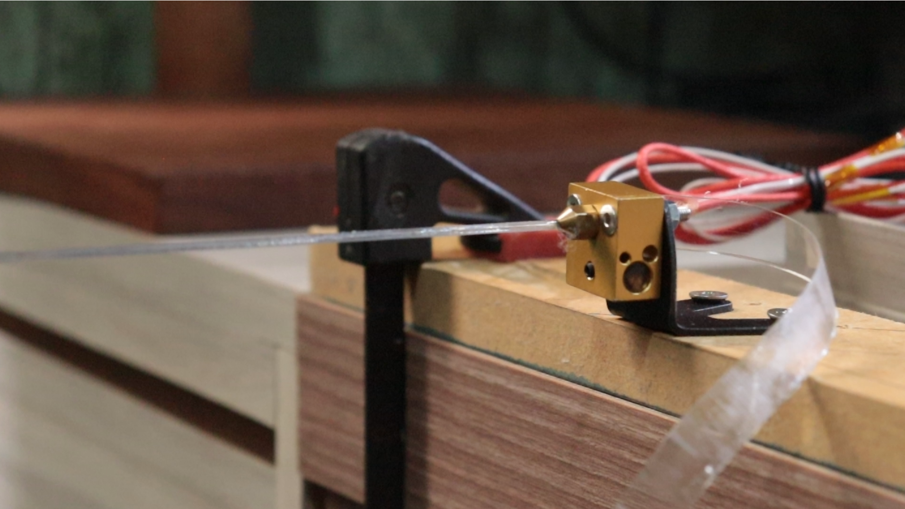
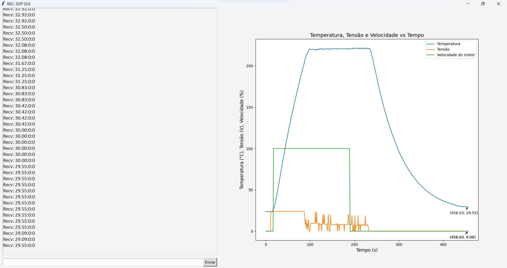

# REC-3DP  
Recicladora de Garrafa PET para Impressão 3D  
  
> **Apresentado à Faculdade Engenheiro Salvador Arena (FESA)**  
> **Apresentaçãoo de artigo no SIMAC**
>
> **Desenvolvido por:**
>
> Adolfo Dias <061200020@faculdade.cefsa.edu.br>  
> Camila Tvardoski <062200002@faculdade.cefsa.edu.br>  
> Gustavo Arenas <061200006@faculdade.cefsa.edu.br>  
> Pedro Scapin <061200008@faculdade.cefsa.edu.br>  
> Rebeca Vitoretti <062200020@faculdade.cefsa.edu.br>  

## Desenvolvimento de um sistema de conversão de garrafa PET em filamento para impressão 3D
Com a popularização da impressão 3D nos dias de hoje, a busca por insumos de qualidade e acessíveis aumenta cada vez mais. No presente trabalho, foi realizado o desenvolvimento de um protótipo de máquina para transformação de garrafas PET em filamentos para impressão 3D. O objetivo do projeto foi propor uma solução de baixo custo a fim de viabilizar a produção de filamentos sustentáveis a partir do PET, um material com excelentes propriedades mecânicas e facilmente adquirido para reciclagem. O projeto consiste em: desenvolver um sistema de controle de temperatura PID para trefilação do filamento; desenvolver um sistema de controle de velocidade para o motor de passo acoplado a um sistema de tracionamento com redutor, a fim de manter o diâmetro do material trefilado constante; implementar uma interface visual de controle intuitiva para a máquina; e incorporar um filetador para a adequação das garrafas PET para o processo. O resultado do trabalho é um protótipo que demonstra a facilidade de produção de filamentos para impressão 3D utilizando garrafas PET recicladas, contribuindo assim para a redução de impactos ambientais associados a esse material.

## Design do dispositivo

### Protótipo: funcionamento
[Recicladora PET - Teste 01](https://youtu.be/Kp44HoyRCVU)

### Protótipo: hardware
* Placa Creality3D V1.1.4 (Ender 3 Series)
* Motor de passo NEMA 17 - VZS1740-048-1004 (Vurtz Motors)
* Termistor NTC-100k
* MOSFETs de potência N-Channel - RF1S30N06LESM (Fairchild Semiconductor)
* Encoder rotativo com switch - KY-040 (Handson Technology)
* Display LCD 16x2 com interface serial I2C (Handson Technology)
* Cartucho aquecedor 24V 40W Ender 3 (Creality3D)

## Interface visual - UART

Implementação de uma interface visual para controle do dispositivo via porta serial. Além do terminal para comunicação bidirecional entre o dispositivo e um guest, foi implementada também uma plotagem que é atualizada em tempo real das principais variáveis de processo (temperatura do Hotend, tensão fornecida e velocidade do motor)

Funções disponívels (G-CODE):
* M104 S___: Configura o novo setpoint para temperatura do Hotend (com feedback, controlador PID)
* F___: Configura o novo setpoint para velocidade do motor (sem feedback)

